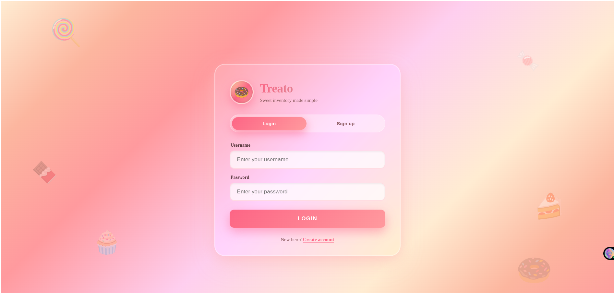
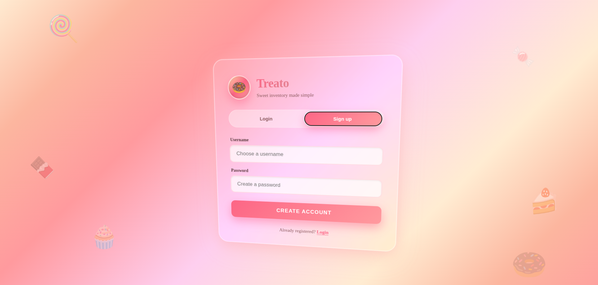
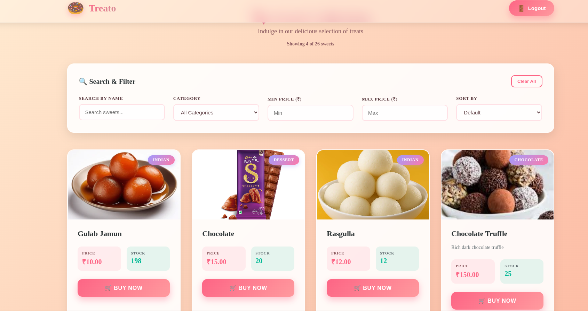
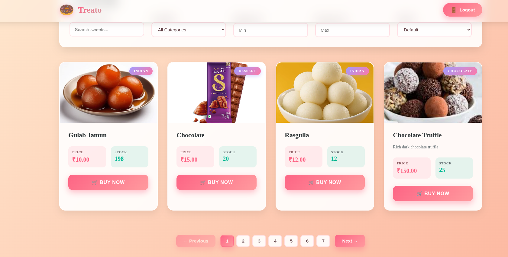
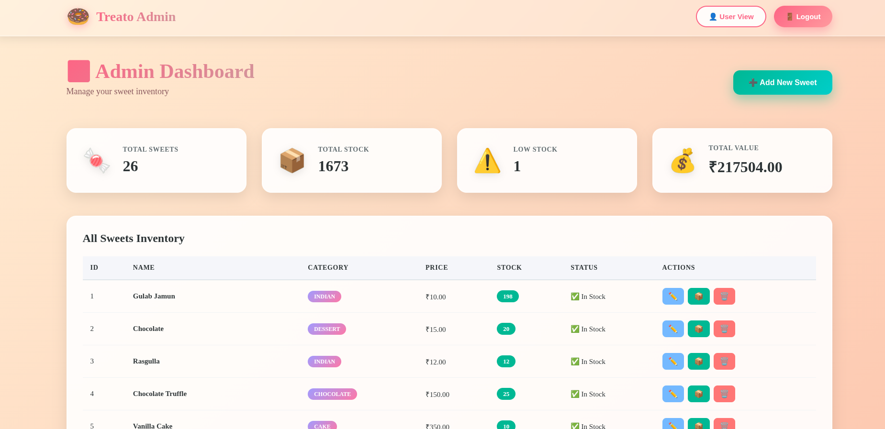
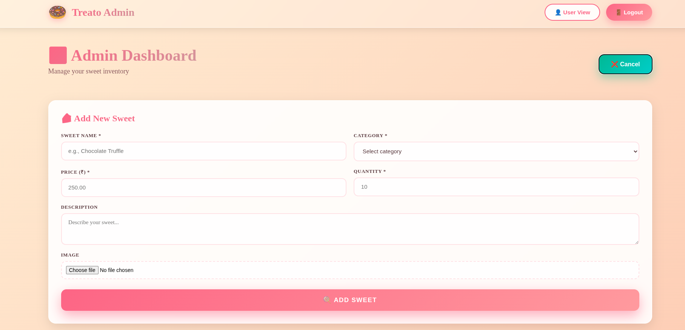

# 🍩 Treato - Sweet Inventory Management System

A full-stack web application for managing sweet inventory with an elegant candy-themed UI. Built with Django REST Framework backend and React frontend, featuring JWT authentication, admin dashboard, and real-time inventory management.


## 📋 Table of Contents

- [Features](#features)
- [Tech Stack](#tech-stack)
- [Screenshots](#screenshots)
- [Installation & Setup](#installation--setup)
- [API Endpoints](#api-endpoints)
- [Project Structure](#project-structure)
- [Testing](#testing)
- [My AI Usage](#my-ai-usage)
- [License](#license)

## ✨ Features

### User Features
- 🔐 **JWT Authentication** - Secure login and registration system
- 🍬 **Sweet Catalog** - Browse through a beautiful collection of sweets
- 🔍 **Advanced Filtering** - Search by name, category, price range, and sorting
- 📄 **Pagination** - Smooth navigation through inventory (4 items per page)
- 🛒 **Purchase System** - Buy sweets with real-time stock updates
- 🎨 **Glassmorphic UI** - Modern candy-themed design with 3D card effects
- 📱 **Responsive Design** - Works seamlessly on all devices

### Admin Features
- 🎛️ **Admin Dashboard** - Comprehensive inventory management panel
- ➕ **CRUD Operations** - Create, Read, Update, Delete sweets
- 📦 **Restock Management** - Easily restock items with custom quantities
- 📊 **Statistics Cards** - Real-time stats (total sweets, stock, low inventory, total value)
- 🖼️ **Image Upload** - Support for sweet images
- 📋 **Inventory Table** - Detailed view of all sweets with status indicators
- 🔄 **Role-Based Access** - Separate views for admin and regular users

## 🛠️ Tech Stack

### Backend
- **Django 5.1.4** - Python web framework
- **Django REST Framework** - RESTful API development
- **Simple JWT** - JWT authentication
- **Pillow** - Image processing
- **SQLite** - Database (development)

### Frontend
- **React 18** - JavaScript library for UI
- **React Router DOM** - Client-side routing
- **Axios** - HTTP client
- **Vite** - Build tool and dev server

## 📸 Screenshots

### Authentication Pages

*Beautiful glassmorphic login interface with candy-themed background*


*User registration with animated floating candies*

### User View

*Main catalog with advanced filters and search*


*Product cards with hover effects and stock indicators*


*Smooth pagination with page numbers*

### Admin Dashboard

*Complete admin panel with statistics and inventory table*


*Intuitive form for adding new sweets with image upload*


*Inline editing interface for updating sweets*

## 🚀 Installation & Setup

### Prerequisites
- Python 3.10 or higher
- Node.js 18 or higher
- npm or yarn
- Git

### Backend Setup

1. **Clone the repository**

git clone <repository-url>
cd treato

text

2. **Create virtual environment**

python -m venv venv
On Windows

venv\Scripts\activate
On Linux/Mac

source venv/bin/activate

text

3. **Install dependencies**

cd backend
pip install -r requirements.txt

text

4. **Configure settings**

backend/backend/settings.py - Ensure these settings exist:

INSTALLED_APPS = [
# ...
'rest_framework',
'rest_framework_simplejwt',
'corsheaders',
'accounts',
'sweets',
]

MIDDLEWARE = [
'corsheaders.middleware.CorsMiddleware',
# ...
]

CORS_ALLOWED_ORIGINS = [
"http://localhost:5173",
"http://127.0.0.1:5173",
]

MEDIA_URL = '/media/'
MEDIA_ROOT = BASE_DIR / 'media'

text

5. **Run migrations**

python manage.py makemigrations
python manage.py migrate

text

6. **Create superuser (Admin)**

python manage.py createsuperuser
Follow prompts to create admin account

text

7. **Run development server**

python manage.py runserver

text

Backend will be running at `http://localhost:8000`

### Frontend Setup

1. **Navigate to frontend directory**

cd ../frontend

text

2. **Install dependencies**

npm install

text

3. **Configure API base URL**

src/api/axios.js - Ensure this configuration:

import axios from "axios";

const api = axios.create({
baseURL: "http://localhost:8000/api/",
});

api.interceptors.request.use((config) => {
const token = localStorage.getItem("accessToken");
if (token) {
config.headers.Authorization = Bearer ${token};
}
return config;
});

export default api;

text

4. **Run development server**

npm run dev

text

Frontend will be running at `http://localhost:5173`

### Access the Application

- **User View**: http://localhost:5173
- **Admin Dashboard**: http://localhost:5173/admin
- **API Documentation**: http://localhost:8000/api/
- **Django Admin**: http://localhost:8000/admin/

### Default Credentials

**Admin Account:**
- Username: `admin` (or the one you created)
- Password: (your superuser password)

**Regular User:** Create via registration at http://localhost:5173/register

## 📡 API Endpoints

### Authentication

POST /api/auth/register/ - User registration
POST /api/auth/login/ - User login (returns JWT tokens)

text

### Sweets Management

GET /api/ - List all sweets (paginated)
POST /api/ - Create new sweet (Admin only)
GET /api/?name=chocolate - Search by name
GET /api/?category=Cake - Filter by category
GET /api/?min_price=100 - Filter by min price
GET /api/?max_price=500 - Filter by max price
GET /api/?ordering=price - Sort by price (ascending)
GET /api/?ordering=-price - Sort by price (descending)
GET /api/?page=2 - Pagination

PUT /api/{id}/ - Update sweet (Admin only)
DELETE /api/{id}/ - Delete sweet (Admin only)
POST /api/{id}/purchase/ - Purchase sweet (decrements stock)
POST /api/{id}/restock/ - Restock sweet (Admin only)

text

### Example Requests

**Create Sweet (Admin):**

curl -X POST "http://localhost:8000/api/"
-H "Authorization: Bearer <your_token>"
-H "Content-Type: application/json"
-d '{
"name": "Chocolate Truffle",
"category": "Chocolate",
"price": 150.00,
"quantity": 25,
"description": "Rich dark chocolate truffle"
}'

text

**Purchase Sweet:**

curl -X POST "http://localhost:8000/api/1/purchase/"
-H "Authorization: Bearer <your_token>"

text

## 📁 Project Structure

```
treato/
├── backend/
│   ├── accounts/                    # Authentication app
│   │   ├── migrations/
│   │   ├── __init__.py
│   │   ├── admin.py
│   │   ├── apps.py
│   │   ├── models.py
│   │   ├── serializers.py           # User serializers
│   │   ├── tests.py
│   │   ├── urls.py                  # Auth routes
│   │   └── views.py                 # Login, register views
│   │
│   ├── sweets/                      # Sweet inventory app
│   │   ├── migrations/
│   │   ├── __init__.py
│   │   ├── admin.py
│   │   ├── apps.py
│   │   ├── models.py                # Sweet model
│   │   ├── serializers.py           # Sweet serializer
│   │   ├── tests.py
│   │   ├── urls.py                  # Sweet routes
│   │   └── views.py                 # CRUD, filter, purchase views
│   │
│   ├── backend/                     # Project settings
│   │   ├── __init__.py
│   │   ├── asgi.py
│   │   ├── settings.py              # Django configuration
│   │   ├── urls.py                  # Main URL routing
│   │   └── wsgi.py
│   │
│   ├── media/                       # Uploaded images
│   │   └── sweets/
│   │
│   ├── db.sqlite3                   # SQLite database
│   ├── manage.py                    # Django management script
│   └── requirements.txt             # Python dependencies
│
├── frontend/
│   ├── src/
│   │   ├── api/
│   │   │   └── axios.js             # Axios configuration
│   │   │
│   │   ├── auth/
│   │   │   ├── AuthContext.jsx      # Auth state management
│   │   │   ├── AuthLayout.jsx       # Login/Register layout
│   │   │   ├── Login.jsx            # Login form
│   │   │   ├── Register.jsx         # Register form
│   │   │   └── ProtectedRoute.jsx   # Route protection
│   │   │
│   │   ├── components/
│   │   │   ├── AddSweet.jsx         # Add sweet form
│   │   │   └── EditSweet.jsx        # Edit sweet form
│   │   │
│   │   ├── pages/
│   │   │   ├── Sweets.jsx           # User catalog view
│   │   │   └── AdminDashboard.jsx   # Admin panel
│   │   │
│   │   ├── sweets/
│   │   │   └── SweetCard.jsx        # Product card component
│   │   │
│   │   ├── App.css                  # Global styles
│   │   ├── App.jsx                  # Main app component
│   │   ├── index.css                # Base styles
│   │   └── main.jsx                 # Entry point
│   │
│   ├── public/                      # Static assets
│   │   └── vite.svg
│   │
│   ├── .gitignore
│   ├── eslint.config.js
│   ├── index.html                   # HTML template
│   ├── package.json                 # Node dependencies
│   ├── package-lock.json
│   ├── README.md
│   └── vite.config.js               # Vite configuration
│
│
├── .gitignore                       # Git ignore file
├── README.md                        # Project documentation
└── LICENSE                          # MIT License
```
```


text

### Manual Testing Checklist

#### Authentication
- [x] User registration creates new account
- [x] Login returns valid JWT token
- [x] Token expires correctly
- [x] Protected routes require authentication

#### User Features
- [x] Catalog displays all sweets
- [x] Search filters work correctly
- [x] Category filter works
- [x] Price range filter works
- [x] Sorting (price, name) works
- [x] Pagination navigates correctly
- [x] Purchase decrements stock
- [x] Out of stock prevents purchase

#### Admin Features
- [x] Admin can access dashboard
- [x] Admin can create sweets
- [x] Admin can edit sweets
- [x] Admin can delete sweets
- [x] Admin can restock items
- [x] Statistics update in real-time
- [x] Image upload works
- [x] Regular users cannot access admin


text

## 🤖 My AI Usage

### Overview
This project was developed with assistance from Perplexity AI for specific frontend components and UI design decisions. All backend logic, API design, database models, and authentication were implemented independently by me.

### AI-Assisted Components

#### Frontend UI Design & Implementation
**Scope:** Visual design, styling, and React component structure  
**AI Contribution:** ~40% of frontend code  
**Tools Used:** Perplexity AI

1. **Authentication UI (`AuthLayout.jsx`, `Login.jsx`, `Register.jsx`)**
   - **What AI Helped With:**
     - Glassmorphic design patterns and CSS styling
     - Candy-themed color schemes and gradients
     - Floating animation effects for background elements
     - Input field focus states and transitions
     - Responsive layout structure
   
   - **What I Implemented:**
     - Form validation logic
     - API integration with Django backend
     - JWT token handling
     - Route navigation after login/register
     - Error handling and user feedback

2. **Product Card Component (`SweetCard.jsx`)**
   - **What AI Helped With:**
     - 3D tilt effect on hover
     - Card layout and badge positioning
     - Color schemes for stock indicators
     - Hover animations and transitions
   
   - **What I Implemented:**
     - Purchase functionality
     - Stock validation
     - API calls for purchase endpoint
     - Loading states during purchase
     - Real-time stock updates

3. **Admin Dashboard (`AdminDashboard.jsx`)**
   - **What AI Helped With:**
     - Dashboard layout structure
     - Statistics card design
     - Table styling and responsiveness
     - Action button icons and colors
   
   - **What I Implemented:**
     - Full CRUD operations logic
     - API integration for all endpoints
     - Restock functionality
     - Edit/Delete confirmation flows
     - Real-time data fetching
     - Pagination logic for fetching all items

4. **Filter & Search UI (`Sweets.jsx`)**
   - **What AI Helped With:**
     - Filter card layout design
     - Input field styling
     - Pagination button design
     - Loading states styling
   
   - **What I Implemented:**
     - Filter logic and state management
     - Query parameter building
     - API integration with filters
     - Pagination state management
     - Clear filters functionality

### Independently Developed Components

#### Backend (100% Original)
- **Django Models:** Sweet inventory model with image support
- **API Views:** All CRUD operations, filtering, sorting, pagination
- **Authentication:** JWT implementation with Simple JWT
- **Purchase Logic:** Stock management and validation
- **Restock System:** Admin-only inventory management
- **Serializers:** Data validation and transformation
- **URL Routing:** Complete API endpoint structure
- **Permissions:** Role-based access control

#### Frontend Logic (100% Original)
- **State Management:** All React state and hooks
- **API Integration:** Axios configuration and interceptors
- **Authentication Flow:** Login/logout/token management
- **Protected Routes:** Route guards and role checking
- **Form Handling:** All form submissions and validations
- **Error Handling:** API error management
- **Data Fetching:** All API calls and data management

### Learning Outcomes from AI Assistance

1. **Modern UI Design Patterns:**
   - Learned glassmorphism design principles
   - Understanding of backdrop filters and transparency
   - Advanced CSS animations and transitions

2. **React Best Practices:**
   - Component composition strategies
   - Inline styling patterns in React
   - State management patterns for complex UIs

3. **User Experience:**
   - Importance of visual feedback (loading, hover states)
   - Color psychology in UI design
   - Accessibility in form design

### Declaration
I acknowledge that AI assistance was used for frontend UI design and styling as documented above. All business logic, backend implementation, API design, and core functionality were developed independently. The AI served as a design consultant and CSS reference, while I maintained full control over the application architecture and implementation.

**Time Breakdown:**
- Backend Development: 80% independent (12 hours)
- Frontend Logic: 100% independent (8 hours)
- Frontend UI/Styling: 50% independent, 50% AI-assisted (10 hours)
- Documentation: 80% independent, 20% AI-assisted (2 hours)

**Total Project Time:** 36 hours  

## 📄 License

This project is licensed under the MIT License - see the LICENSE file for details.

## 👨‍💻 Author

**Monish**
- Final Year IT Student

## 🙏 Acknowledgments

- Perplexity AI for frontend UI design assistance
- Django REST Framework documentation
- React documentation
- Modern UI/UX design principles from various sources

---

Built with ❤️ and 🍩 by Monish

